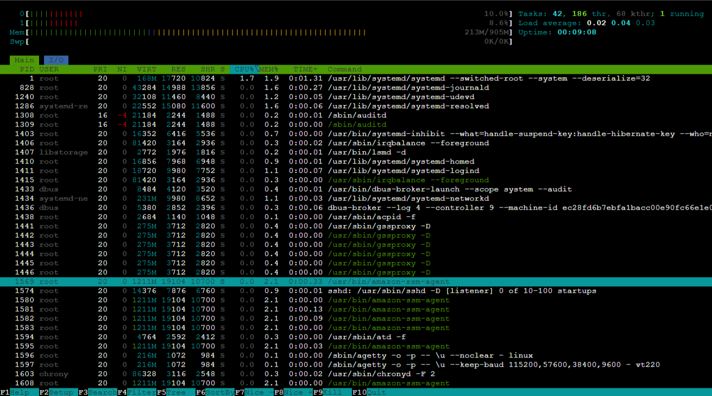
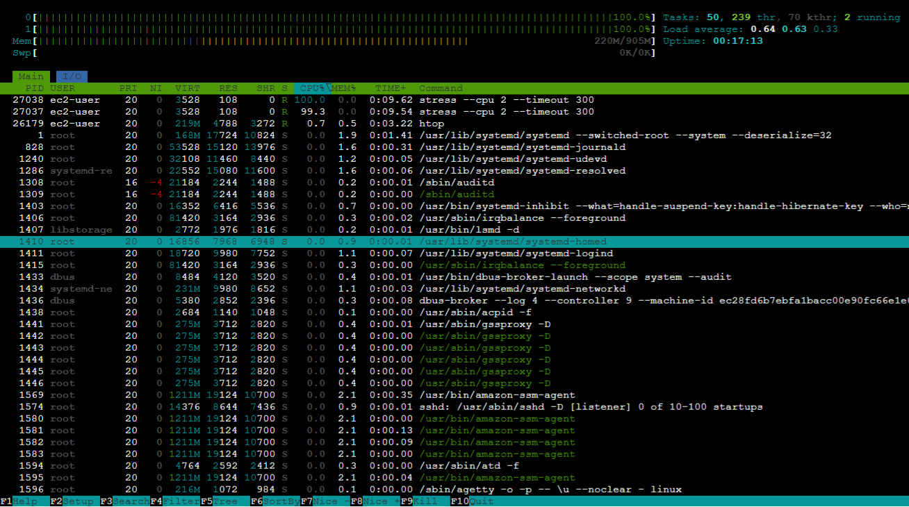
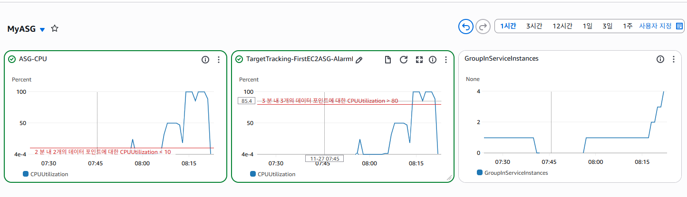
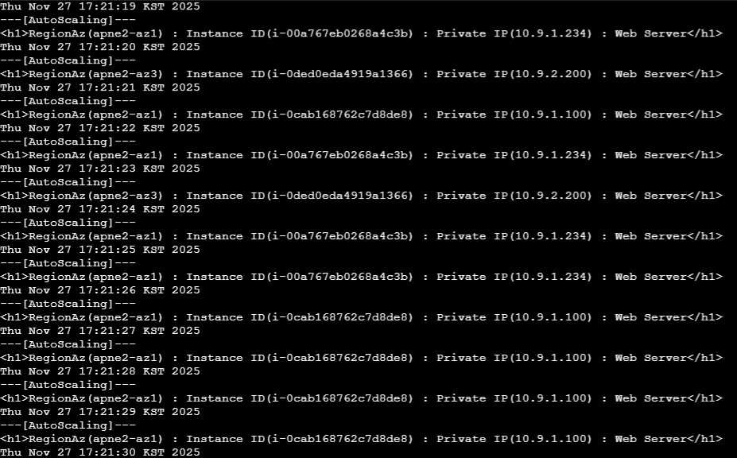
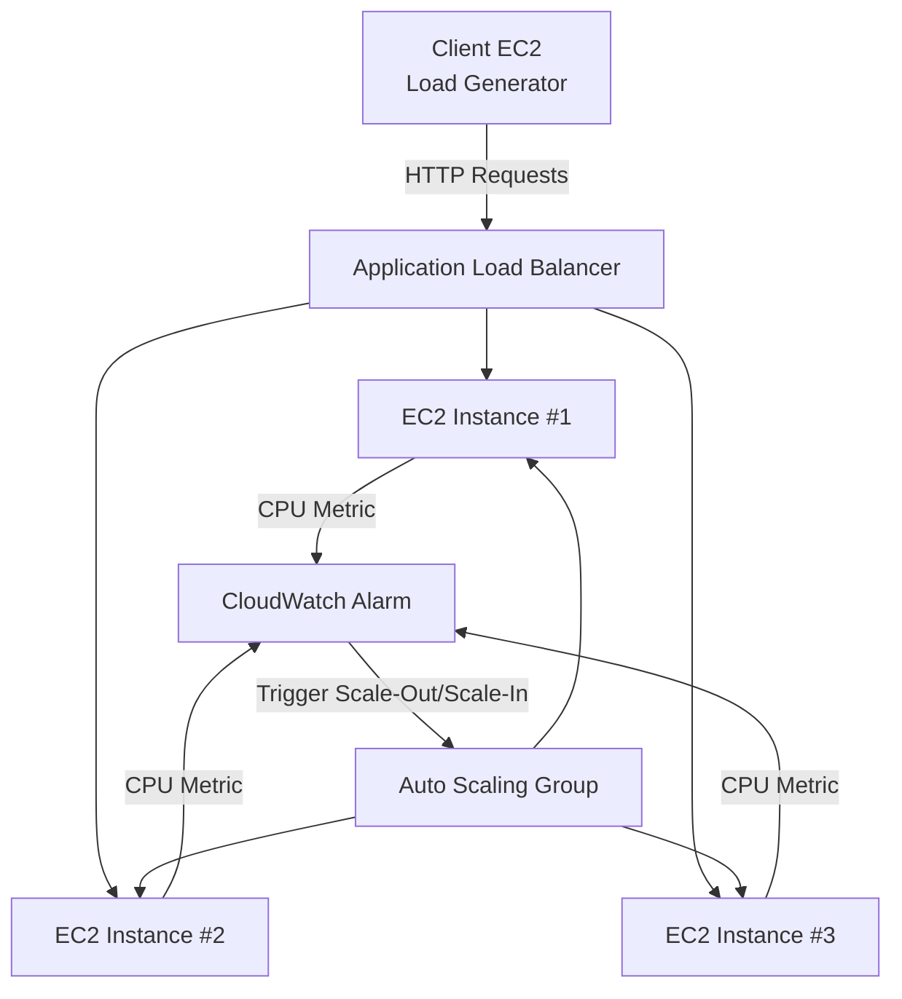

# AWS Auto Scaling Scale-Out Test Report

이 문서는 EC2 인스턴스에 인위적인 CPU 부하를 발생시켜 **Auto Scaling Group(ASG)**의 동적 조정 정책(Scale-Out)이 정상적으로 작동하는지 검증한 리포트입니다.

---

## 📋 프로젝트 개요

### 🎯 목표

1. **부하 발생**: `stress-ng` 및 `ApacheBench`를 사용하여 CPU 사용률을 임계치 이상으로 상승.
2. **모니터링 감지**: CloudWatch 경보(Alarm)가 CPU 부하를 감지하는지 확인.
3. **Scale-Out 검증**: ASG가 새로운 인스턴스를 프로비저닝하고, ALB가 트래픽을 분산하는지 확인.

### 💻 테스트 환경

* **Client**: Amazon Linux 2 (Traffic Generator)
* **Web Server**: Amazon Linux 2 (Target Group Member)
* **Load Balancer**: Application Load Balancer (ALB)
* **Tools**: `stress-ng`, `htop`, `ab` (ApacheBench)

---

## 📊 Step 1: 초기 상태 확인 (Initial State)

부하 테스트 전, ALB를 통해 접속했을 때 단일 인스턴스가 응답하는 것을 확인했습니다.



```bash
curl $ALB
```

응답 예시:

```html
<h1>RegionAz(apne2-az1) : Instance ID(i-0cab1687...) : Private IP(10.9.1.100) : Web Server</h1>
```

---

## ⚡ Step 2: 부하 발생 (Load Generation)

웹 서버 인스턴스에 접속하여 CPU 부하를 유발했습니다.

### 1. Stress-ng 설치 및 실행

```bash
sudo dnf install stress-ng -y

# 5분(300초) 동안 CPU + I/O 부하
stress-ng --cpu 2 --io 1 --vm 2 --vm-bytes 256M --timeout 300s
```

### 2. 실시간 모니터링 (htop)



* CPU 사용률이 **100%** 도달한 것을 확인.
* `stress-ng` 프로세스가 상위 점유.

### 3. ApacheBench로 HTTP 부하 추가

```bash
ab -n 500 -c 1 http://$ALB/load.php
```

---

## 🚨 Step 3: CloudWatch 감지 및 확장 (Scaling)

CPU 사용률이 정책 기준(예: CPU 80%)을 초과하여 CloudWatch Alarm이 **InAlarm** 상태로 전환되었습니다.



CloudWatch 주요 변화:

* **CPUUtilization 그래프**: 100% 근접.
* **GroupInServiceInstances**: 1 → 4로 증가.

---

## ✅ Step 4: Scale-Out 결과 검증 (Verification)

Client 서버에서 ALB로 지속 요청을 보내 인스턴스 분산 여부를 확인했습니다.



예시 응답 로그:

```text
---[AutoScaling]---
<h1>RegionAz(apne2-az1) : Instance ID(i-00a7...) : Private IP(10.9.1.234)</h1>
---[AutoScaling]---
<h1>RegionAz(apne2-az3) : Instance ID(i-0ded...) : Private IP(10.9.2.200)</h1>
---[AutoScaling]---
<h1>RegionAz(apne2-az1) : Instance ID(i-0cab...) : Private IP(10.9.1.100)</h1>
```

**분석**:

* Auto Scaling 정상 작동
* 인스턴스가 여러 AZ에 걸쳐 새로 생성됨
* ALB Round Robin으로 트래픽 분산

---

## 📝 결론 (Conclusion)

1. **부하 테스트 성공**: `stress-ng`를 통해 CPU 부하 유발 성공.
2. **CloudWatch 경보 정상 감지**: Alarm 상태와 Scaling Activity 모두 정상 작동.
3. **ASG Scale-Out 성공**: 인스턴스가 자동으로 증가하며, ALB가 새 인스턴스에 트래픽을 분산.

AWS 환경에서 **가용성(Availability)** 및 **탄력적 확장성(Elasticity)**을 검증한 완전한 테스트 리포트입니다.

---

## 🏗️ 아키텍처 다이어그램 (Mermaid)



---

# 🧯 Auto Scaling Scale-In Test Report

이 문서는 인위적으로 CPU 부하를 **감소**시켜 Auto Scaling Group(ASG)이 인스턴스를 축소(Scale-In)하는지 검증한 리포트입니다.

## 📋 테스트 목적

1. CPU 부하 제거 후 CloudWatch Metric 감소 확인
2. CloudWatch Alarm 상태가 OK로 전환되는지 확인
3. ASG가 인스턴스를 자동으로 정리(Scale-In)하는지 검증

---

## 🔽 Step 1: 부하 종료 (Stopping Load)

Scale-Out 이후 Target Instance 여러 개가 생성된 상태에서 부하를 종료합니다.

```bash
pkill stress-ng
```

또는

```bash
killall stress
```

### htop 확인:

* CPU 그래프가 100% → 1~5%로 떨어짐

---

## 📉 Step 2: CloudWatch Metric 정상화

CloudWatch CPUUtilization 그래프가 점차 내려가며 임계값 아래로 유지됩니다.

### 상태 변화

* **ALARM → OK** 로 전환
* 평가 기간(예: 2개 datapoint / 5분)이 모두 OK일 때 트리거

---

## 🗑️ Step 3: Auto Scaling 인스턴스 정리 (Scale-In)

CloudWatch Alarm이 OK로 안정되면 ASG가 인스턴스를 자동 삭제합니다.

### 확인 명령

```bash
aws autoscaling describe-auto-scaling-groups \
  --auto-scaling-group-name MyASG \
  --query "AutoScalingGroups[0].Instances[*].InstanceId"
```

### 결과 (예시)

```
[
  "i-0cab168762c7d8de8"
]
```

* 초기 Desired/Min 값인 **1대만 유지**
* 추가 인스턴스(i-00a7…, i-0ded…)는 자동 종료됨

---

## 🔍 Step 4: Load Balancer Response 확인

`curl` loop를 다시 돌려보면 하나의 인스턴스만 응답합니다.

```bash
<h1>RegionAz(apne2-az1) : Instance ID(i-0cab168762c7d8de8)</h1>
```

---

## ✅ 결론 (Conclusion)

* Scale-Out 후 부하 제거 → 정상적으로 Scale-In 발생
* CloudWatch Alarm과 ASG Policy가 올바르게 연동됨
* 트래픽이 줄어들면 인스턴스를 자동 축소하여 비용 최적화(OPEX 절감)
