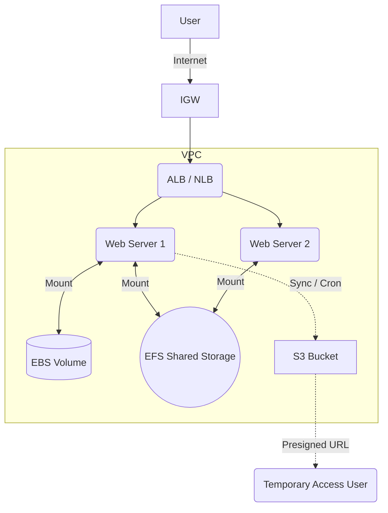

# ☁️ AWS Infrastructure Lab: Network & Storage

> **주제**: AWS 핵심 네트워크(ELB)와 스토리지 서비스(EBS, EFS, S3)의 구축, 운영, 트러블슈팅 실습 로그 및 정리

## 1. 실습 개요 (Overview)

본 리포지토리는 AWS의 주요 인프라 서비스를 직접 CLI 환경에서 구축하고 검증한 실습 기록입니다.

* **Network**: ALB(L7)와 NLB(L4)를 통한 부하 분산 및 트러블슈팅.
* **Storage**:
    * **EBS**: 블록 스토리지의 볼륨 확장 및 영구 마운트 설정.
    * **EFS**: 다중 인스턴스 간 공유 파일 시스템 구축.
    * **S3**: 객체 스토리지 CLI 제어, 자동 동기화(Cron), 보안 URL 생성.

## 2. Architecture Diagrams



## 3. ELB (Elastic Load Balancing) 실습

**L7(HTTP) 및 L4(UDP/SNMP) 트래픽 부하 분산 구성**

### 3.1 주요 작업 내용

* **ALB (Application Load Balancer)**: HTTP(80) 트래픽 Round Robin 분산, `X-Forwarded-For` 헤더로 Client IP 식별.
* **NLB (Network Load Balancer)**: UDP(161) SNMP 트래픽 분산, Client IP Preservation 확인.

### 3.2 핵심 트러블슈팅

1. Connection Timeout: 보안 그룹(Security Group) HTTP(80) 인바운드 누락 → 수정
2. Private IP 통신 불가: 서로 다른 VPC → Public IP 사용
3. Cross-Zone Load Balancing: 특정 AZ 편중 방지 → 활성화

## 4. EBS (Elastic Block Store) 실습

**블록 스토리지 용량 확장 및 관리**

### 4.1 주요 작업 내용

1. 볼륨 포맷 및 마운트: NVMe 기반(`nvme1n1`) XFS, `/data` 마운트
2. 영구 마운트: `/etc/fstab`에 UUID 등록
3. 무중단 볼륨 확장: 콘솔 볼륨 증설 → `growpart` → `xfs_growfs`

### 4.2 핵심 명령어

```bash
# 파티션 확장
sudo growpart /dev/nvme0n1 1

# XFS 파일 시스템 확장
sudo xfs_growfs -d /

# 영구 마운트 설정 (fstab)
UUID=[Vol_UUID] /data xfs defaults,nofail 0 2
```

## 5. EFS (Elastic File System) 실습

**Linux 인스턴스 간 공유 스토리지 구축**

### 5.1 주요 작업 내용

1. 클라이언트 설정: `amazon-efs-utils` 설치, 필요 시 `pip3 install botocore`
2. 마운트 및 검증: EC2-1 → EC2-2 파일 공유 확인, RWX 권한 검증

## 6. S3 (Simple Storage Service) 실습

**객체 스토리지 관리 및 자동화**

### 6.1 Bucket 관리 및 CLI 제어

* 버킷 생성: `aws s3 mb s3://[Bucket-Name]`
* 파일 업로드: `aws s3 cp`

### 6.2 데이터 동기화 자동화 (Sync & Cron)

```bash
# Sync 명령어
aws s3 sync --delete [Source] [Target]

# Crontab 등록 (1분마다 실행)
*/1 * * * * root aws s3 sync --delete /var/www/html s3://buckettest991126-s3-private
```

### 6.3 Presigned URL (미리 서명된 URL)

```bash
# 유효기간 120초 URL 생성
aws s3 presign s3://[Bucket_Name]/[File_Name] --expires-in 120
```

## 7. 결론 및 배운 점 (Key Takeaways)

1. 스토리지 적재적소 활용: EBS(부팅/I/O), EFS(공유), S3(백업/대용량)
2. 자동화 중요: Crontab + AWS CLI = 간단 DR 체계 구축
3. 네트워크 보안: Presigned URL로 안전 공유

### 🛠 Tech Stack

* Cloud Provider: AWS (EC2, ELB, EBS, EFS, S3)
* OS: Amazon Linux 2
* Web Server: Apache HTTP Server
* Tools: AWS CLI, tcpdump, snmpget
