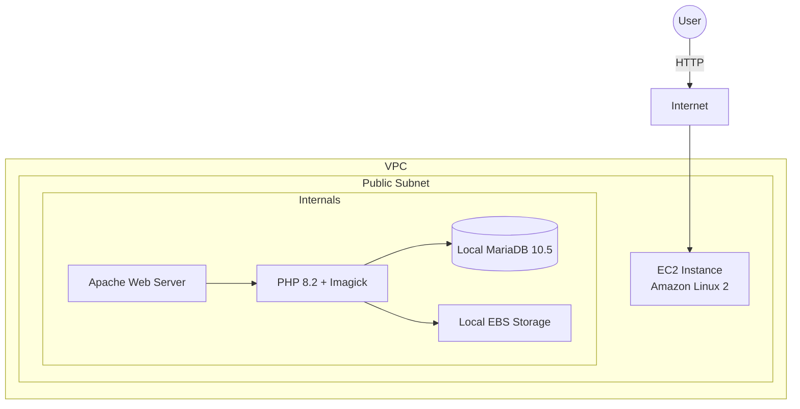

# AWS WordPress Architecture Evolution: From Monolithic to Scalable

이 프로젝트는 Amazon Linux 2 환경에서 **WordPress**를 구축하는 전체 과정을 기록한 문서입니다.
초기의 **단일 인스턴스(All-In-One)** 구성부터 시작하여, **AWS 관리형 서비스(RDS, EFS)**를 도입해 확장성 있는 **분산 아키텍처(Decoupled Architecture)**로 고도화하는 과정을 단계별로 다룹니다.

## 📚 목차 (Table of Contents)
1. [Phase 1: All-In-One Monolithic Architecture](#phase-1-all-in-one-monolithic-architecture)
2. [Phase 2: Scalable Decoupled Architecture](#phase-2-scalable-decoupled-architecture)

---

# Phase 1: All-In-One Monolithic Architecture

가장 기본적인 형태로, 하나의 EC2 인스턴스 내부에 웹 서버, 데이터베이스, 스토리지 기능이 모두 포함된 구성입니다.

### 🏗️ Architecture (Phase 1)

🛠️ Step 1: LAMP Stack 설치
1. Apache Web Server 설치
웹 서버를 설치하고 구동합니다.

Bash

yum install httpd -y
systemctl start httpd && systemctl enable httpd
httpd -v

# 접속 테스트
curl http://localhost
2. PHP 8.2 및 Imagick 설치
워드프레스 구동 및 이미지 처리를 위한 모듈을 설치합니다.

Bash

amazon-linux-extras install php8.2 -y
yum install -y php-xml php-mbstring ImageMagick ImageMagick-devel php-pear php-devel

# Imagick 설치 및 설정
printf "\n" | pecl install imagick
echo "extension=imagick.so" > /etc/php.d/40-imgick.ini

systemctl restart php-fpm && systemctl restart httpd
3. Local MariaDB 설치 및 설정
Bash

amazon-linux-extras install mariadb10.5 -y
systemctl start mariadb && systemctl enable mariadb

# 보안 설정 및 DB 생성
echo -e "\n n\n n\n Y\n n\n Y\n Y\n" | /usr/bin/mysql_secure_installation

mysql -e "set password = password('qwe123');"
mysql -e "GRANT ALL PRIVILEGES ON *.* TO 'root'@'%' IDENTIFIED BY 'qwe123';"
mysql -e "CREATE DATABASE wordpressdb"
📦 Step 2: WordPress 배포 (Local)
1. 다운로드 및 설정
Bash

wget [https://wordpress.org/wordpress-6.2.zip](https://wordpress.org/wordpress-6.2.zip)
unzip wordpress-6.2.zip

# 설정 파일 생성
cp wordpress/wp-config-sample.php wordpress/wp-config.php

# DB 정보 수정 (Localhost)
sed -i "s/database_name_here/wordpressdb/g" wordpress/wp-config.php
sed -i "s/username_here/root/g" wordpress/wp-config.php
sed -i "s/password_here/qwe123/g" wordpress/wp-config.php
2. 권한 설정 및 결과 확인
Bash

cp -r wordpress/* /var/www/html/
chown -R apache /var/www
chmod 2775 /var/www
find /var/www -type d -exec chmod 2775 {} \;
find /var/www -type f -exec chmod 0664 {} \;
systemctl restart httpd
초기 구축 결과:

Phase 2: Scalable Decoupled Architecture
단일 서버의 한계(SPOF, 스케일링 어려움)를 극복하기 위해 EC2(Web), RDS(DB), **EFS(Storage)**로 역할을 분리한 아키텍처입니다.

🏗️ Architecture (Phase 2)
코드 스니펫

graph TD
    User((User)) -->|HTTP Request| Internet
    subgraph VPC [AWS VPC]
        subgraph Public Subnet
            EC2[Web Server Instance (Stateless)]
        end
        
        subgraph Private Subnet / Services
            EFS[Elastic File System (Shared Storage)]
            RDS[(Amazon RDS MySQL 8.0)]
        end

        EC2 -->|NFS Mount / var/www/wordpress| EFS
        EC2 -->|SQL Query / Port 3306| RDS
    end
🔄 Data Flow
코드 스니펫

sequenceDiagram
    participant Admin as Administrator
    participant EC2 as EC2 (Web Server)
    participant EFS as AWS EFS
    participant RDS as AWS RDS

    Note over EC2, EFS: 1. Storage Connection
    EC2->>EFS: Mount /var/www/wordpress (NFSv4)
    EFS-->>EC2: Storage Attached (8.0 EB Capacity)

    Note over EC2, RDS: 2. Database Connection
    Admin->>EC2: Update wp-config.php (DB_HOST -> RDS Endpoint)
    EC2->>RDS: Connect (User: root)
    Admin->>RDS: CREATE DATABASE wordpressdb

    Note over Admin, RDS: 3. Service Verification
    EC2->>EFS: Read PHP Core Files
    EC2->>RDS: Read/Write Content Data
    EC2-->>Admin: Show WordPress Dashboard
📂 Step 1: Shared Storage (EFS)
워드프레스 소스 코드와 미디어 파일을 공유 스토리지인 EFS로 이관하여, EC2 인스턴스가 상태 비저장(Stateless) 성격을 갖도록 구성했습니다.

EFS 마운트 확인
Bash

[root@WebSrv ~]# df -hT --type nfs4
Filesystem                                            Type  Size  Used Avail Use% Mounted on
fs-08e091c81e170664a.efs.ap-northeast-2.amazonaws.com:/ nfs4  8.0E   79M  8.0E   1% /var/www/wordpress
EFS 상태 정보 (AWS CLI)
Bash

aws efs describe-file-systems --output table --region ap-northeast-2
# FileSystemId: fs-08e091c81e170664a
# LifeCycleState: available
# Name: WebSrv-EFS
🗄️ Step 2: Managed Database (RDS)
로컬 DB를 중단하고, AWS RDS(MySQL)로 데이터베이스 연결을 전환했습니다.

1. RDS 정보 확인
Bash

# RDS 엔드포인트 추출
aws rds describe-db-instances --region ap-northeast-2 --query 'DBInstances[*].Endpoint.Address' --output text

# 변수 등록
RDS=wpdb.crquyssi02m2.ap-northeast-2.rds.amazonaws.com
2. wp-config.php 수정 (Migration)
기존 localhost 설정을 RDS 엔드포인트로 변경합니다.

Bash

# 변경 전 확인
grep 'Database settings' /var/www/wordpress/wp-config.php -A15
# define( 'DB_HOST', 'localhost' );

# 엔드포인트 치환
sed -i "s/localhost/$RDS/g" /var/www/wordpress/wp-config.php

# 변경 후 확인
grep 'Database settings' /var/www/wordpress/wp-config.php -A15
# define( 'DB_HOST', 'wpdb.crquyssi02m2.ap-northeast-2.rds.amazonaws.com' );
3. 원격 데이터베이스 생성
EC2에서 RDS로 접속하여 워드프레스용 데이터베이스를 생성합니다.

Bash

# RDS 접속 및 DB 생성
mysql -h $RDS -uroot -pqwe12345 -e 'CREATE DATABASE wordpressdb;'

# 생성 확인
mysql -h $RDS -uroot -pqwe12345 -e 'show databases;'
# +--------------------+
# | wordpressdb        | <-- 확인됨
# +--------------------+
✅ Final Verification
분산 아키텍처 환경(EC2 + RDS + EFS)에서 워드프레스 관리자 페이지 접속 및 기능 동작을 확인했습니다.

URL: http://54.180.150.186/wp-admin/

Result: 정상 접속 (대시보드 활성화)

🚀 Conclusion
이 프로젝트를 통해 다음과 같은 아키텍처 개선을 달성했습니다.

가용성(Availability) 향상: DB를 Multi-AZ 지원이 가능한 RDS로 분리하여 데이터 안정성을 확보했습니다.

확장성(Scalability) 확보: 웹 서버의 데이터를 EFS로 분리함으로써, 트래픽 증가 시 EC2 인스턴스를 자유롭게 Auto Scaling 할 수 있는 기반을 마련했습니다.

운영 효율성: 관리형 서비스를 도입하여 OS 및 DB 엔진 패치 등의 관리 부담을 줄였습니다.